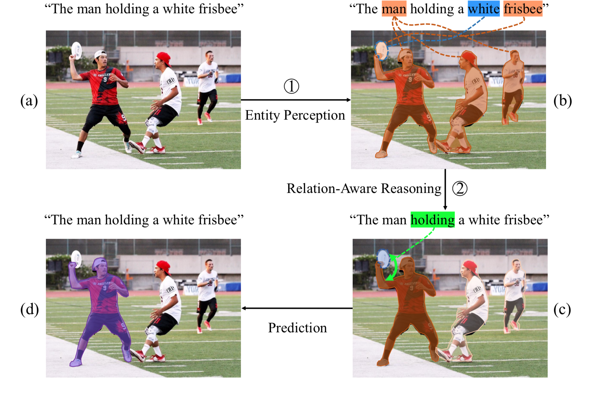

# Referring-Image-Segmentation-via-Cross-Modal-Progressive-Comprehension
Code for Referring Image Segmentation via Cross-Modal Progressive Comprehension, CVPR2020

* Interpretation of our progressive referring segmentation method.

(a) Input referring expression and image. (b) The model first perceives all the entities described in the expression based on entity words and attribute words, e.g., “man” and “white frisbee”(orange masks and blue outline). (c) After finding out all the candi-date entities that may match with input expression, relational word 087 “holding” can be further exploited to highlight the entity involved
with the relationship (green arrow) and suppress the others which 088 are not involved. (d) Benefiting from the relation-aware reasoning 089 process, the referred entity is found as the final prediction (purple mask)..

